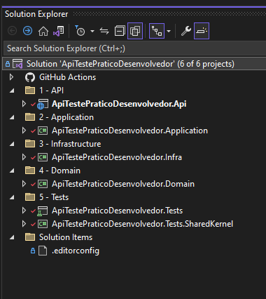
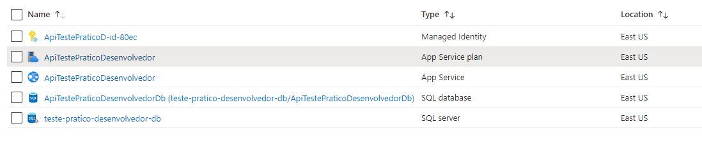
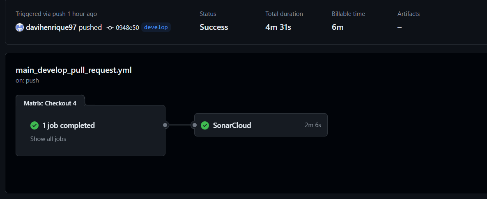
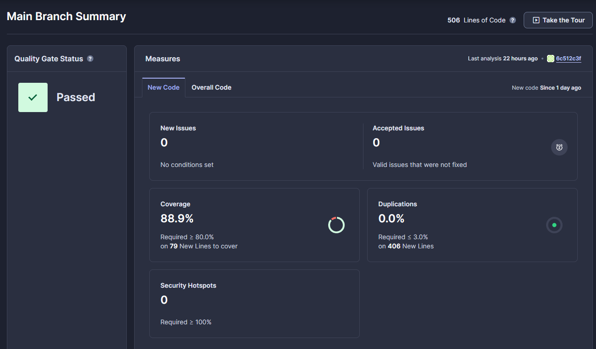

# ApiTestePraticoDesenvolvedor

## Solution:

 __1 - API__:  
Contém a Aplicação com os Controllers.

 __2 - Application__:  
Contém os Serviços.

__3 - Infrastructure__:  
Contém Migration, Repositorios e o DatabaseContext.

__4 - Domain__:  
Contém Entities e DTOs.

__5 - Tests__:  
Contém os Projetos referente aos Teste de Unidade.

 

## Postman Collections:
Collection do Postman para auxiliar os testes:

[Ir para a Collection](./docs/Davi_ApiTestePraticoDesenvolvedor.postman_collection.json)

_A API retornar os Erros com Código 422_

## Azure:
__Swagger:__  
https://apitestepraticodesenvolvedor.azurewebsites.net/swagger/index.html

A Aplicação está em um [__Web App__](https://azure.microsoft.com/pt-br/products/app-service/web) conectada ao um [__SQL database__](https://azure.microsoft.com/pt-br/products/azure-sql/database).

 

## GitHub Actions:

## main_apitestepraticodesenvolvedor.yml:
Quando o código é recebido na branch __main__.  
É feito as seguintes ações:
- Checkout
- SonarCloud
- Build
- Deploy Azure

 __Print:__  

 

## main_develop_pull_request.yml:
Quando o código é recebido na branch __develop__ ou quando é feito PR para branchs __main__ e __develop__.
É feito as seguintes ações:
 - Checkout
 - SonarCloud

 __Print:__  
 

 ## SonarCloud:

__SonarCloud__  
 https://sonarcloud.io/summary/new_code?id=davihenrique97_ApiTestePraticoDesenvolvedor

 

Utilizado o SonarCloud para verificar a qualidade e a cobertura dos testes de Unidade.

## Pacotes Nugets Utilizados:

### AutoMapper

Pacote Nuget utilizado para fazer mapeamento de objetos.  
Utilizado para deixar o código mais limpo e facilitar o mapeamento de objetos.

## FluentValidation

Pacote Nuget utilizado para fazer validações de objetos.  
Utilizado para validar o corpo das requisições.  

## Entity Framework Core

Biblioteca de mapeamento objeto-relacional (ORM).  
Utilizado para fazer a abordagem "Code First".

## Scrutor
  
Pacote Nuget utilizado para realizar a injeção de dependência.  

## coverlet.collector
  
Pacote Nuget utilizado  para medir cobertura de testes.

## FluentAssertions
  
Pacote Nuget com conjunto de métodos que permitem especificar de forma mais natural o resultado esperado de testes de unidade.

## xunit
  
Pacote Nuget para Testes de Unidade.